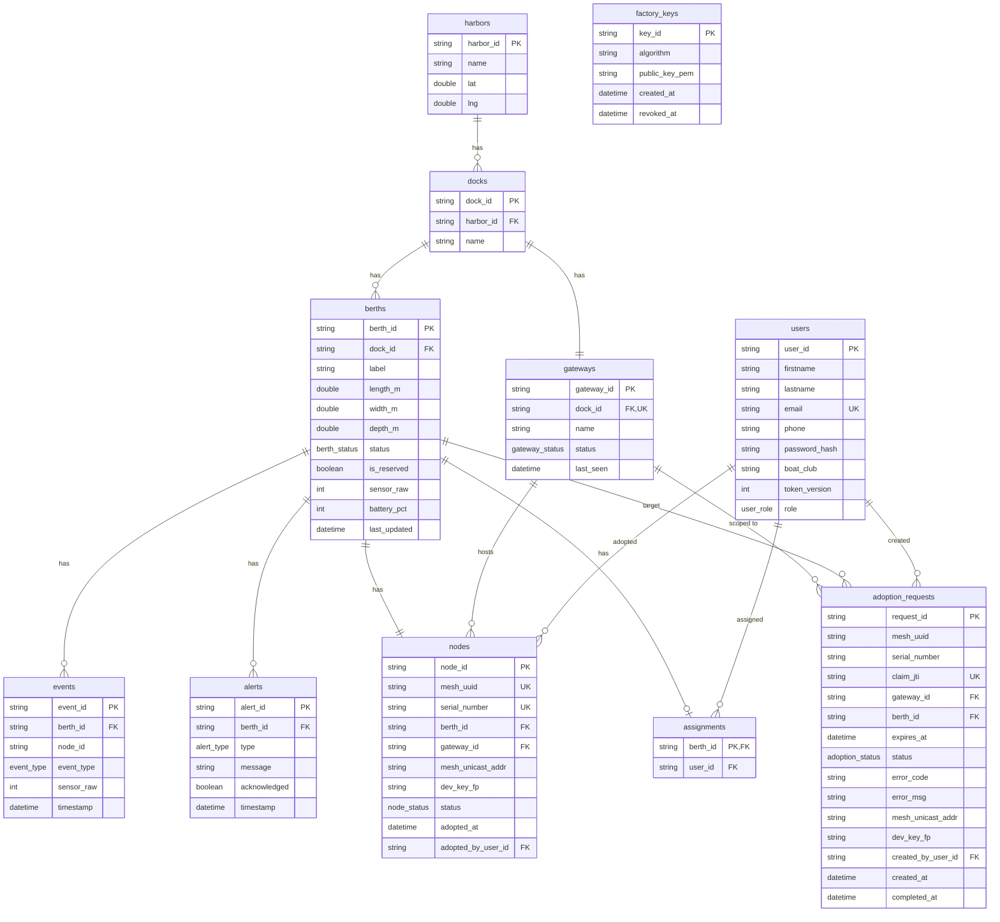

# Database Schema

```mermaid
erDiagram
    users {
        string user_id PK
        string firstname
        string lastname
        string email UK
        string phone
        string password_hash
        string boat_club
        int token_version
        user_role role
    }

    harbors {
        string harbor_id PK
        string name
        double lat
        double lng
    }

    docks {
        string dock_id PK
        string harbor_id FK
        string name
    }

    berths {
        string berth_id PK
        string dock_id FK
        string label
        double length_m
        double width_m
        double depth_m
        berth_status status
        boolean is_reserved
        int sensor_raw
        int battery_pct
        datetime last_updated
    }

    events {
        string event_id PK
        string berth_id FK
        string node_id
        event_type event_type
        int sensor_raw
        datetime timestamp
    }

    alerts {
        string alert_id PK
        string berth_id FK
        alert_type type
        string message
        boolean acknowledged
        datetime timestamp
    }

    gateways {
        string gateway_id PK
        string dock_id FK,UK
        string name
        gateway_status status
        datetime last_seen
    }

    nodes {
        string node_id PK
        string mesh_uuid UK
        string serial_number UK
        string berth_id FK
        string gateway_id FK
        string mesh_unicast_addr
        string dev_key_fp
        node_status status
        datetime adopted_at
        string adopted_by_user_id FK
    }

    adoption_requests {
        string request_id PK
        string mesh_uuid
        string serial_number
        string claim_jti UK
        string gateway_id FK
        string berth_id FK
        datetime expires_at
        adoption_status status
        string error_code
        string error_msg
        string mesh_unicast_addr
        string dev_key_fp
        string created_by_user_id FK
        datetime created_at
        datetime completed_at
    }

    factory_keys {
        string key_id PK
        string algorithm
        string public_key_pem
        datetime created_at
        datetime revoked_at
    }

    assignments {
        string berth_id PK,FK
        string user_id FK
    }

    harbors ||--o{ docks : "has"
    docks ||--o{ berths : "has"
    docks ||--|| gateways : "has"
    berths ||--o{ events : "has"
    berths ||--o{ alerts : "has"
    berths ||--|| nodes : "has"
    berths ||--o| assignments : "has"
    gateways ||--o{ nodes : "hosts"
    gateways ||--o{ adoption_requests : "scoped to"
    berths ||--o{ adoption_requests : "target"
    users ||--o{ assignments : "assigned"
    users ||--o{ nodes : "adopted"
    users ||--o{ adoption_requests : "created"
```
