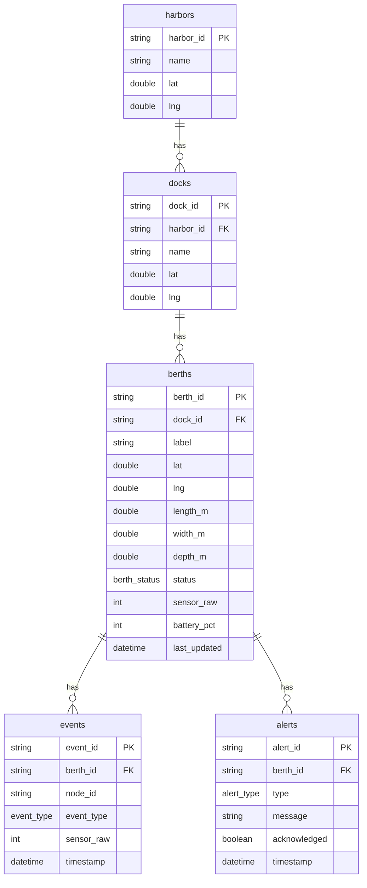

# Database Schema

```mermaid
erDiagram
    harbors {
        string harbor_id PK
        string name
        double lat
        double lng
    }

    docks {
        string dock_id PK
        string harbor_id FK
        string name
        double lat
        double lng
    }

    berths {
        string berth_id PK
        string dock_id FK
        string label
        double lat
        double lng
        double length_m
        double width_m
        double depth_m
        berth_status status
        int sensor_raw
        int battery_pct
        datetime last_updated
    }

    events {
        string event_id PK
        string berth_id FK
        string node_id
        event_type event_type
        int sensor_raw
        datetime timestamp
    }

    alerts {
        string alert_id PK
        string berth_id FK
        alert_type type
        string message
        boolean acknowledged
        datetime timestamp
    }

    harbors ||--o{ docks : "has"
    docks ||--o{ berths : "has"
    berths ||--o{ events : "has"
    berths ||--o{ alerts : "has"
```
